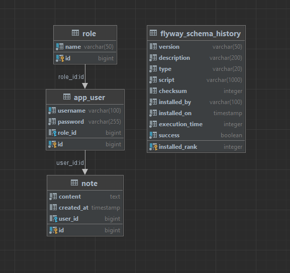
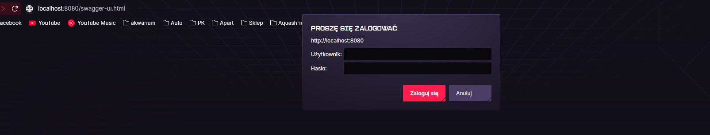
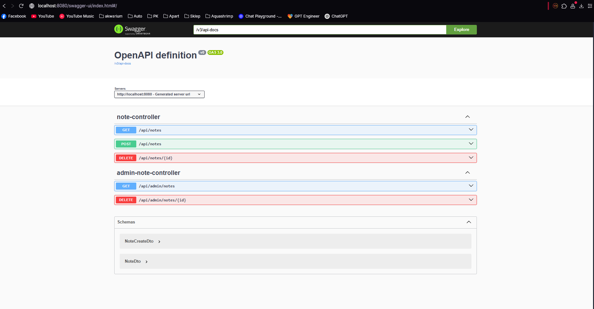
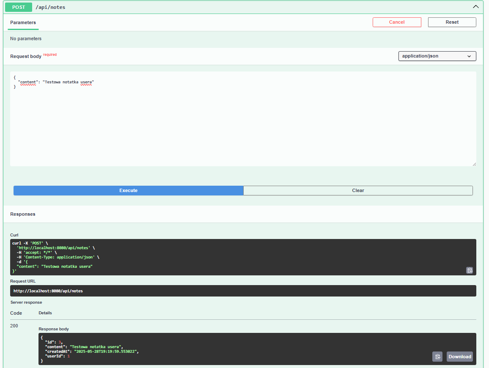
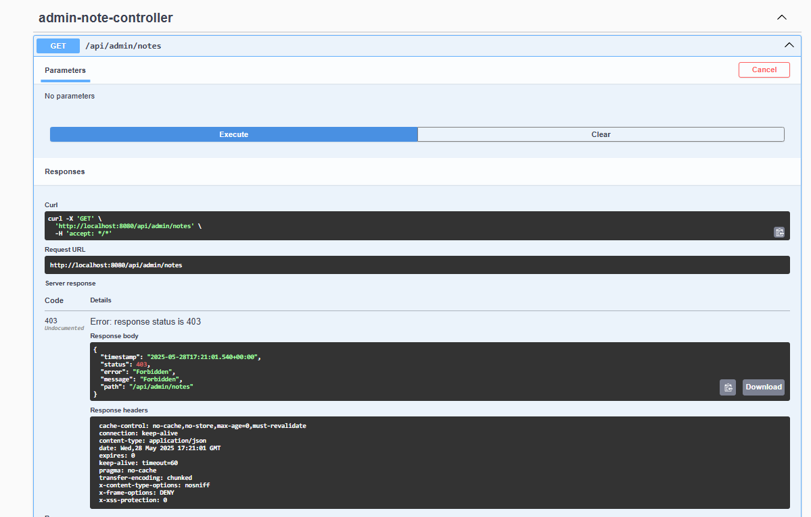
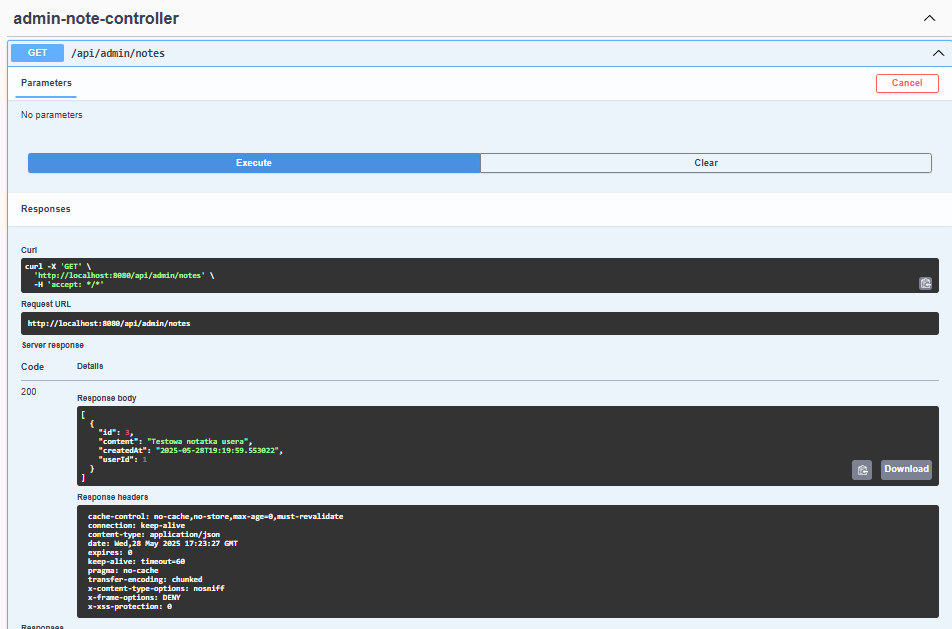
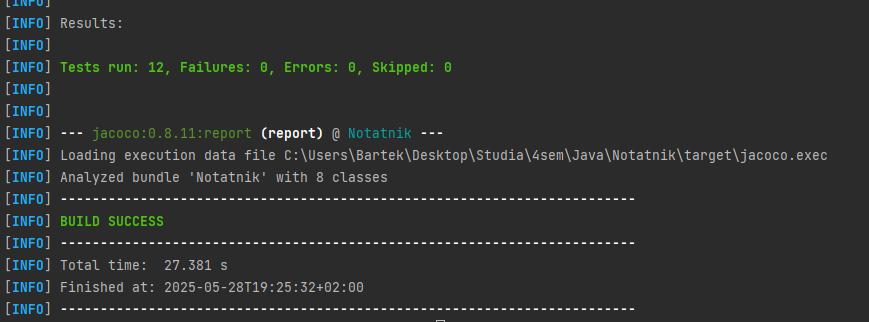
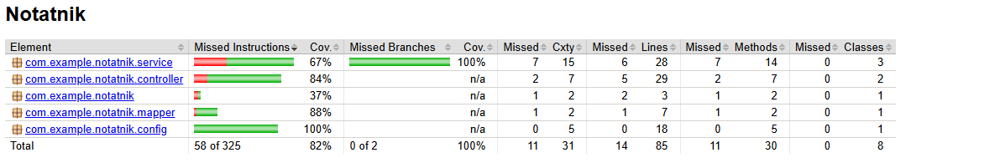

# AUTOR : Bartłomiej Kwiatkowski 152692 GK03
# Notatnik – Dokumentacja projektu 

## 1. Opis projektu

**Notatnik** - Aplikacja która pozwala użytkownikom na dodawanie, przeglądanie i usuwanie swoich notatek. Admin ma dodatkowe uprawnienia do usuwania dowolnych notatek i zarządzania notatkami użytkowników
### Zastosowany wzorzec projektowy
W projekcie zastosowano wzorzec **Dependency Injection (DI)**, który umożliwia automatyczne wstrzykiwanie zależności pomiędzy komponentami aplikacji. Dzięki temu komponenty są mniej powiązane ze sobą, co poprawia modularność, ułatwia testowanie oraz utrzymanie kodu. W Spring Framework DI jest fundamentem organizacji architektury aplikacji.

Ponadto, w celu zwiększenia elastyczności i zgodności z zasadami programowania obiektowego, zastosowano **polimorfizm** poprzez definiowanie interfejsów (NoteService, AppUserService, RoleService) oraz ich implementacji (NoteServiceImpl itd.). Takie podejście pozwala na programowanie względem abstrakcji oraz umożliwia łatwą rozbudowę i podmianę implementacji bez konieczności modyfikacji korzystających z nich komponentów.
### Autentykacja
Autentykacja w projekcie jest realizowana za pomocą **Spring Security**z wbudowaną pamięciową bazą użytkowników (In-Memory Authentication). Użytkownicy i ich role są zdefiniowani statycznie w konfiguracji, a dostęp do endpointów jest kontrolowany na podstawie przypisanych ról (RBAC).

### Technologie:
- Java 21, Maven
- Spring Boot (REST API, Spring Security)
- Hibernate + PostgreSQL (Docker)
- Flyway do migracji bazy danych
- Testy jednostkowe JUnit (>80% pokrycia)
- Swagger UI dla dokumentacji API
- Docker + Docker Compose

---

## 2. Struktura projektu

- `src/main/java/com/example/notatnik/entity` – encje bazy danych (Role, AppUser, Note)
- `src/main/java/com/example/notatnik/repository` – repozytoria Spring Data JPA
- `src/main/java/com/example/notatnik/service` – logika biznesowa (serwisy)
- `src/main/java/com/example/notatnik/dto` – obiekty transferu danych (DTO)
- `src/main/java/com/example/notatnik/controller` – REST API kontrolery
- `src/main/resources/db/migration` – skrypty Flyway migracji bazy danych
- `src/test/java` – testy jednostkowe
- `docker-compose.yml` – konfiguracja kontenerów PostgreSQL
- `pom.xml` – konfiguracja Maven
- `README.md` – dokumentacja projektu

---

## 3. Wymagania i funkcjonalności

- Role Based Access Control (RBAC) – role USER i ADMIN
- Użytkownicy mogą tworzyć, przeglądać i usuwać własne notatki
- Administrator może zarządzać wszystkimi notatkami i użytkownikami
- Aplikacja zabezpieczona Spring Security
- Automatyczne migracje bazy danych z Flyway
- Testy jednostkowe pokrywające minimum 80% kodu
- REST API z dokumentacją Swagger UI

---

## 4. Uruchomienie projektu

### Wymagania

- Zainstalowany Docker
- Zainstalowany Maven
- Java 17

### Instrukcje

1. Uruchom bazę PostgreSQL w Dockerze:
    ```bash
   docker-compose up -d
(plik docker-compose.yml jest w repozytorium)

Sprawdź, czy kontener działa:
    
    docker ps
Powinien być widoczny kontener notatnik_postgres.
    
Uruchom aplikację Spring Boot:
    
    mvn spring-boot:run
Aplikacja będzie dostępna na porcie 8080.
    
Otwórz Swagger UI w przeglądarce:
http://localhost:8080/swagger-ui.html
Możesz testować endpointy REST bezpośrednio z poziomu tej strony.

## 5. Dostępne konta testowe

| Rola  | Login | Hasło    |
|-------|-------|----------|
| USER  | user  | userpass |
| ADMIN | admin | adminpass |

---

## 6. Migracje bazy danych

Migracje odbywają się automatycznie przy starcie aplikacji dzięki Flyway.  
Skrypty migracji znajdują się w katalogu:  
`src/main/resources/db/migration`

---

## 7. Diagram ERD bazy danych

Poniżej znajduje się diagram ERD przedstawiający strukturę i relacje bazy danych:



*Plik `notatnik-erd.png` dołączony jest w katalogu `docs` projektu.*

---

## 8. Screeny działania

### Spring Security



### Widok Swagger UI – lista endpointów



### Dodanie notatki przez usera


### Próba użycia admin-note-controller przez usera


### Użycie admin-note-controller GET przez admina


### Wynik mvn clean test

### Pokrycie Testów


---

## 9. Uruchamianie testów

Aby uruchomić testy jednostkowe, wykonaj w terminalu polecenie:

    mvn clean test
### 10. Wyłączanie projektu
Aby zatrzymać i usunąć kontenery z bazą, wykonaj:

    docker-compose down -v
